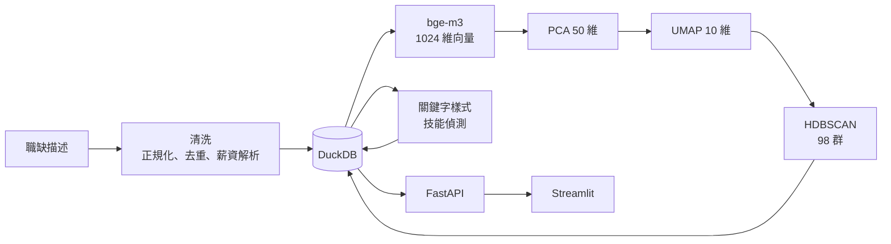

# taiwan-job-market-semantics

以語意向量分析台灣職缺市場的結構。

平台既有的職務分類是人工訂定且長期不變的，同一個標籤底下的工作內容會隨時間改變，而跨標籤的相似工作也不會被歸在一起。本專案不使用這些標籤，改以職缺描述的語意向量重新建立分類，再據此分析數位職缺與 AI 技能的分布。

分析對象為 2026-05-19 採集的 **64,643 筆**職缺。

**線上展示：<https://haoagentuse-glitch.github.io/taiwan-job-market-semantics/>**

展示頁為靜態版本，所有視圖已預先算成 JSON（1.5 MB），不依賴後端服務。
完整版包含 FastAPI 查詢介面與 Streamlit 儀表板，程式碼在本倉庫中，於本機執行。

---

## 主要結果

以非監督方式從職缺描述長出 **98 個語意群集**，最大群集佔 6.0%，前十群合計 37.1%。

| 群集 | 職缺數 |
|---|---:|
| 美編人員 | 3,875 |
| 軟體工程師 | 3,827 |
| 保全員 | 3,122 |
| 倉管人員 | 2,954 |
| 廚房人員 | 2,347 |

技能分布如下。相對薪資為該技能職缺的月薪中位數除以全體中位數（35,000）。

| 技能 | 職缺數 | 佔全體 | 月薪中位 | 相對薪資 |
|---|---:|---:|---:|---:|
| 數位行銷／電商 | 1,348 | 2.09% | 33,000 | 0.94× |
| 資料分析／BI | 1,199 | 1.85% | 36,025 | 1.03× |
| 軟體開發 | 1,122 | 1.74% | 38,388 | 1.10× |
| 生成式 AI／LLM | 255 | 0.39% | 38,388 | 1.10× |
| 機器學習／深度學習 | 234 | 0.36% | 40,000 | 1.14× |
| 雲端／DevOps | 210 | 0.32% | 41,677 | 1.19× |
| 電腦視覺／影像辨識 | 83 | 0.13% | 38,720 | 1.11× |
| 資料工程 | 80 | 0.12% | 41,667 | 1.19× |

**AI 技能職缺 472 筆，佔全體 0.73%；數位技能職缺 3,616 筆，佔 5.59%。**

技能不受職務分類限制：「資料分析／BI」的第二大來源是行銷企劃類（261 筆）、第三是研究教育類（151 筆）。僅依職務分類統計會低估這類需求。

---

## 方法



職缺描述經 bge-m3 編碼後降維分群，群集數量未事先指定。群集名稱取自群內出現次數最多的職稱，並清除招募話術（括號內的「免打卡」「百萬年薪不是夢」等）。

| 層 | 工具 | 用途 |
|---|---|---|
| 儲存與查詢 | DuckDB | 單檔資料庫，分析以掃描與聚合為主 |
| 文字向量 | bge-m3 | 本機 GPU 產生 1024 維中文語意向量 |
| 降維與分群 | PCA、UMAP、HDBSCAN | 建立語意群集，噪點比例過高時改用 KMeans |
| 服務 | FastAPI | 唯一資料出口，查詢邏輯集中一處 |
| 介面 | Streamlit、Plotly | 儀表板 |
| 環境 | Docker、uv、ruff | 依賴以 `uv.lock` 鎖定，本機與容器一致 |

向量以 `.npy` 儲存而非置於資料庫：分群與最近鄰查詢皆為稠密矩陣運算，由 NumPy 與 PyTorch 直接讀取記憶體映射檔較為單純。

---

## 技能偵測為何不使用向量

原設計為每個技能概念撰寫描述工作內容的錨句，編碼後與職缺向量計算餘弦相似度，以相似度認定技能。此方案在全量資料上測量後否決。

以生成式 AI／LLM 為例：

| 指標 | 數值 |
|---|---:|
| 關鍵字正例的相似度中位數 | 0.590 |
| 全體職缺的相似度中位數 | 0.507 |
| 全體職缺的相似度 P99 | **0.650** |
| 分離度 | 1.43σ |

全體前 1% 的相似度高於真正例的中位數，代表無關職缺的高分尾端與正例重疊。取相似度前 500 名僅召回 21% 的正例；資料分析／BI 置中後分離度僅 0.24σ。

原因為職缺描述中位數僅 128 字，且含大量「工作內容」「福利」「上班時間」等模板語，單一技能詞在整段語意中的比重過低，向量表徵被樣板文字主導。

因此技能偵測改採關鍵字樣式，向量僅用於其有效之處：非監督分群、相似職缺檢索，以及待驗證候選的排序。

### 關鍵字樣式的誤判處理

字串比對命中的是字面。實測中，飯店職缺描述的 `provide prompt service` 會被 `Prompt` 命中，導致 23 筆餐旅職缺被歸入生成式 AI。修正樣式後，該概念由 392 筆降為 255 筆。

所有樣式均經誤判檢查，裸詞 `AI`、`Prompt` 一律不使用。

---

## 執行

需要 Docker、NVIDIA driver 與 NVIDIA Container Toolkit。

```bash
docker compose build
```

```bash
docker compose run --rm --no-deps ingest python -m jobshift.ingest --legacy
```

```bash
docker compose run --rm embed python -m jobshift.embed --snapshot 2026-05-19
```

```bash
docker compose run --rm analyze python -m jobshift.analyze --refit
```

```bash
docker compose run --rm embed python -m jobshift.skills
```

```bash
docker compose up -d api dashboard
```

儀表板 <http://localhost:8501>，API 文件 <http://localhost:8010/docs>。

### 產生靜態展示頁

```bash
docker compose run --rm --no-deps -v "$PWD/docs:/app/docs" ingest python -m jobshift.export_static
```

匯出 `docs/data/` 下的 JSON，由 GitHub Pages 提供。匯出腳本直接呼叫 `api` 模組的函式，
與線上版走同一套查詢邏輯，不另寫一份 SQL，避免兩版數字不一致。

RTX 4060 上，64,643 筆向量化約 8 分鐘，分群約 15 分鐘。分群結果會快取，重跑分析時沿用既有群集定義，需重建時加 `--refit`。

### 開發

```bash
uv sync && uv run ruff check .
```

---

## 專案結構

```text
jobshift/
  settings.py    路徑、快照、採集與分析參數
  crawler.py     資料採集
  ingest.py      清洗、去重、薪資解析、分類對照
  embed.py       bge-m3 向量化
  analyze.py     降維、分群、群集命名
  skills.py      技能偵測與統計
  concepts.py    技能概念定義與偵測樣式
  taxonomy.py    行業與職務分類對照
  api.py         FastAPI 查詢介面
  dashboard.py   Streamlit 儀表板
  export_static.py  匯出靜態展示頁所需的 JSON
  db.py          DuckDB 連線
docs/            GitHub Pages 靜態展示頁
```

---

## 限制

- 單一時間點的橫斷面，描述當期結構，不構成趨勢。
- 來源為單一商業求職平台，雇主組成有其特性，不代表整體勞動市場。
- 採集時每個職務類別設有 4,500 筆上限，熱門類別的絕對數為截斷值，佔比較絕對數可靠。
- 群集邊界由語意模型與分群參數決定，非官方職業分類；噪點比例 20.1%。
- 技能偵測依賴雇主是否於描述中寫出該技能，未寫出者無法偵測。
- 薪資統計僅涵蓋可換算為月薪者（83.3%），面議與論件計酬不計入。

## 授權與使用

程式碼供個人研究與作品展示。資料採集遵守來源站 robots.txt，採單執行緒序列與多層間隔。
