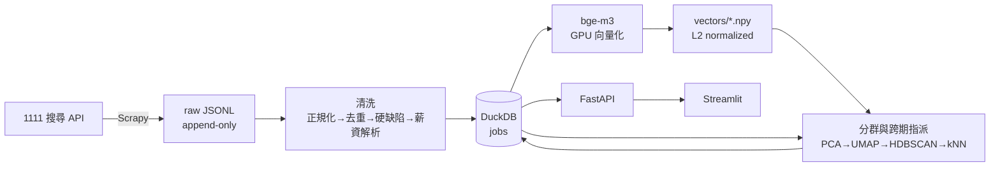

# job-market-transition-tracker

**追蹤台灣職缺市場的語意結構隨時間怎麼變。**
不是統計「哪個職稱變多了」，而是先讓模型自己從職缺描述裡長出「工作的種類」，
再看這些種類的版圖如何消長、有沒有出現過去不存在的新形態、以及哪些公司想找的人換了。

每隔一到兩個月抓一份市場快照，一個指令跑完整條管線，時間軸上就多一個點。

```bash
docker compose run --rm pipeline
```

---

## 這個專案在回答什麼問題

職缺板的分類是人訂的，而且很久不會動。「軟體工程師」這個標籤底下，
2023 年跟 2026 年要的其實是不同的人 —— 但標籤看不出來。

這個專案不用標籤，改用職缺描述的語意向量。做法是：

1. 拿最早那份快照，把 6.5 萬則職缺描述變成 1024 維向量，讓 HDBSCAN 自己找出「工作的種類」
2. 之後每一份新快照，都用 kNN 指派進**同一套種類**裡 —— 所以編號跨期穩定，時間序列才有意義
3. 指派不進去的那些，是舊快照裡沒有的形態。獨立分群、給新編號，然後**併回參考池**，
   下一期就能直接比對到它們

第 3 點是整個設計的重點：**座標系會生長**。新型態一旦出現就被納入詞彙表，
不會每期重新發明一套分類，也不會因為分類固定而永遠看不見新東西。

## 儀表板有什麼

| 視圖 | 回答的問題 |
|---|---|
| 時間軸 | 各期規模、薪資水準、產業佔比的時間序列、產業汰換率 |
| 語意群集 | 哪些工作種類在擴張／萎縮／新生／消亡，佔比變化排行與完整序列 |
| 遷移矩陣 | 存活職缺的「前期群集 → 後期群集」流向，兩端接上「下架」與「新進」讓流量守恆 |
| 產業組成 | 每個產業內部的語意組成如何重組（熱力圖 + Sankey） |
| 公司招募位移 | 哪些公司的招募重心明顯偏移，從什麼種類轉向什麼種類 |
| 相似職缺 | 用向量做最近鄰，可跨期查詢「這個職缺在前一期對應到什麼」 |

---

## 架構



| 層 | 選型 | 為什麼 |
|---|---|---|
| 爬取 | **Scrapy** | 先探第一頁讀 `totalPage`，其餘頁一次排進佇列流水線化；append-only feed，中斷可續 |
| 儲存 | **DuckDB** | 單檔、免 server、免密碼。分析全是掃描與聚合，這正是它的主場 |
| 向量 | **bge-m3**（地端 GPU） | 中文語意品質好、1024 維、可離線；資料不出本機 |
| 分群 | **UMAP + HDBSCAN**（sklearn 內建） | 密度式分群不必先決定群數；噪點比過高時自動退回 KMeans + silhouette 選 k |
| 服務 | **FastAPI** | 唯一資料出口，查詢邏輯只有一份 |
| 前端 | **Streamlit + Plotly** | 資料型儀表板最短路徑，Sankey / 熱力圖都是現成的 |
| 依賴 | **uv + pyproject + ruff** | `uv.lock` 鎖死版本，本機與容器裝到的是同一組 |

向量存 `.npy` 而不是塞進資料庫：分群與 kNN 全是稠密矩陣運算，
`numpy`／`torch` 直接吃記憶體映射最快。DuckDB 只存 metadata 與分析結果，各司其職。

---

## 四個值得說明的設計決定

**① 參考座標系只建一次，而且會生長。**
分群 fit 在最早的快照上，之後每期都是被指派進來的。
若每期各自分群再對齊，群集編號會漂移，看到的「變化」會變成對齊演算法的產物，
而不是市場的變化。代價是參考期的選擇會影響整體視角 —— 換掉它等於所有編號作廢，所以它不該換。

**② 跨期指派用 kNN 多數決，不用群心距離。**
HDBSCAN 的群在降維空間常是非凸的，用群心指派會錯得很難察覺。
kNN 直接在原始 1024 維 cosine 空間投票，非凸也不怕，
而且「票數比例」與「平均相似度」天然就是信心指標 —— 兩個門檻都沒過的就標為未歸類，
那批人正是新形態的候選。

**③ 「遷移」拆成三層，因為 job 層級的群間移動是假的。**
同一則職缺的描述兩期不會變，所以硬做「這則職缺從 A 群移到 B 群」沒有意義。
真正可測的是：群集的量體消長、存活職缺被重新定位的比例、以及**同一家公司**招募重心的向量位移
—— 第三層才是真的「某家公司從找傳統業務轉向找資料分析」。

**④ 爬取階段零過濾。**
前一版的爬蟲在抓取當下就用關鍵字評分把資料丟掉，過濾發生在正規化之前、且與爬蟲綁死 ——
想改判斷標準就得重爬，而且丟掉的資訊回不來。
這版的爬蟲只負責忠實落地，所有語意判斷推遲到向量階段；
清洗階段只擋「結構上不可用」的（空描述、測試職缺），不做任何主觀篩選。

---

## 資料

- 來源：1111 人力銀行的職缺搜尋 API，涵蓋 20 個產業分類
- 參考快照：2026-05-19，**65,519** 筆
- 每產業套用 4,500 筆上限（沿用參考快照的截斷條件，各期一致才可比）
- 職缺描述平均 218 字（p95 642 字）

清洗管線的實測表現（對 65,519 筆參考快照）：

| 項目 | 結果 |
|---|---|
| 薪資型態解析成功率 | 99.9%（月薪 69.5%／面議 14.4%／時薪 11.1%／論件計酬 2.3%／日薪 2.1%／年薪 0.5%） |
| 可換算成月薪的比例 | 83.3%（面議與論件計酬沒有可比數字，一律不計入薪資統計） |
| 硬缺陷過濾 | 1.34%（正規化後描述不足 10 字） |
| 文字正規化 | 長度縮減約 10–15%（HTML、裝飾符號、條列編號、emoji、全形半形統一） |

---

## 執行

需要 Docker、NVIDIA driver 與 `nvidia-container-toolkit`（向量化吃 GPU）。

```bash
docker compose build
```

### 跑一次快照更新

```bash
docker compose run --rm pipeline
```

依序跑 爬取 → 清洗入庫 → 向量化 → 分群與遷移分析。
**可重入**：每個階段先看產物在不在，在就跳過。中途斷掉（網路、額度、當機）
把同一行再跑一次就會從斷點接上。

保守的爬取設定（併發 4、固定 1 秒延遲）約 45–55 分鐘；向量化在 RTX 4060 上約 15–25 分鐘。
想快一點：

```bash
CRAWL_CONCURRENCY=8 CRAWL_DELAY=0.35 docker compose run --rm pipeline
```

### 看結果

```bash
docker compose up -d api dashboard
```

儀表板 <http://localhost:8501>　|　API 文件 <http://localhost:8000/docs>

### 只重跑某個階段

改了分群參數想重算，不必重爬也不必重新向量化：

```bash
docker compose run --rm analyze
```

其餘可單獨執行的服務：`crawl`、`ingest`、`embed`。
`docker compose run --rm pipeline --from-stage embed` 也可以從中途接。

---

## 調整

參數集中在 `jobshift/settings.py`，也可用環境變數覆寫：

| 變數 | 預設 | 說明 |
|---|---|---|
| `JOBSHIFT_SNAPSHOT_DATE` | 今天 | 這次快照的日期標籤 |
| `CRAWL_CONCURRENCY` / `CRAWL_DELAY` | 4 / 1.0 | 爬取併發與間隔 |
| `CRAWL_MAX_PAGES` | 150 | 每產業頁數上限（150 × 30 = 4,500） |
| `JOBSHIFT_EMBED_BATCH` | 64 | 顯存不足就調小 |

分群品質相關的 `KNN_SIM_FLOOR`（未歸類門檻）、`HDBSCAN_MIN_FRAC`（群的最小規模）、
`NOISE_FALLBACK`（噪點超過就退回 KMeans）同樣在 `settings.py`。

---

## 專案結構

```
jobshift/
  settings.py    集中設定：路徑、快照、API 參數、產業分類、分群門檻
  spider.py      Scrapy 爬蟲（零過濾，只忠實落地）
  ingest.py      清洗入庫：正規化 → 去重 → 硬缺陷 → 文字正規化 → 薪資解析
  embed.py       bge-m3 向量化
  analyze.py     分群、跨期指派、三層遷移
  pipeline.py    一個指令跑完，可重入
  api.py         FastAPI，唯一資料出口
  dashboard.py   Streamlit
  db.py          DuckDB 連線
  devdata.py     造假快照，讓整條線在真資料到位前就能驗證
```

---

## 已知限制

- **觀測點少的時候是對照，不是趨勢。** 只有兩份快照時，任何「持續上升／下降」都不成立。
- **各期都被每產業 4,500 筆的上限截斷**，熱門產業的絕對數不是真實總量 —— 看佔比比看總數可靠。
- **參考快照無法重爬**，它是既成事實；因此清洗管線必須對它與新資料一視同仁，
  不能為了新資料調整清洗規則而讓兩期失去可比性。
- **群集的語意邊界是模型給的，不是產業定義。** 群集標籤取自離群心最近的真實職稱，
  可讀但不是權威分類名稱。
- API 參數與參考快照完全一致（含 `isSyncedRecommendJobs=true`，它會跨產業塞推薦職缺），
  去重採全域 first-seen wins —— 這是為了可比性而刻意保留的行為。

## 授權與使用

僅供個人研究與求職作品展示。爬取採保守設定（預設併發 4、固定 1 秒延遲），
請勿用於商業用途或提高頻率施加負載。
