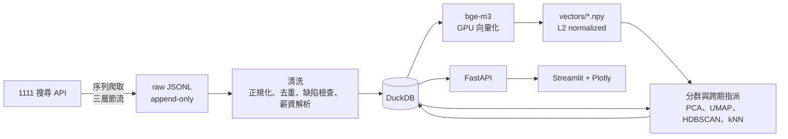

# job-market-transition-tracker

用定期快照觀察台灣職缺市場的語意結構如何變化。

這個專案不直接沿用平台上的職稱或產業標籤，而是將職缺描述轉成向量，由分群結果建立一套可跨期比較的「職缺類型」。後續快照會指派到既有群集；無法可靠歸類的職缺則保留為新型態候選，再經分群後納入參考池。

目前關注的問題包括：

- 哪些職缺類型正在增加或減少？
- 市場上是否出現過去沒有的新型態工作？
- 各產業內部的職缺組成如何改變？
- 公司的招募重心是否發生位移？
- 同一類職缺在不同時間點的薪資與需求有何差異？

整條管線可透過 Docker 執行：

```bash
docker compose run --rm pipeline
```

> 專案仍在持續收集快照。觀測點不足時，結果只能視為兩期對照，不能直接解讀為長期趨勢。

## 分析方法

第一份快照用來建立參考群集，後續快照不重新建立一套分類，而是在原始 1024 維向量空間以 kNN 指派到既有群集。指派同時檢查鄰居票數與平均相似度，信心不足的資料會標記為未歸類。

未歸類資料不會直接被當成新類型。系統會先對它們獨立分群，通過規模與品質條件後才建立新群集，並加入參考池供下一期使用。因此，群集編號可以跨期維持穩定，同時保留辨識新型態職缺的能力。

分析分成三個層次：

1. **市場層**：比較各群集的數量、占比與薪資變化。
2. **職缺層**：檢查存活職缺在重新指派後是否改變位置。
3. **公司層**：計算同一家公司招募組合的向量位移，觀察招募重心是否改變。

同一則職缺的文字在兩期之間通常不會改變，因此本專案不把單一職缺的群間移動直接解讀成職涯或產業「轉型」。較有意義的訊號，是群集規模的消長與公司招募組合的改變。

## 系統流程



### 技術選擇

| 部分 | 工具 | 用途 |
|---|---|---|
| 資料擷取 | requests | 單執行緒序列讀取分頁，將原始回應以 append-only JSONL 保存 |
| 儲存與分析 | DuckDB | 保存職缺資料、群集結果與分析欄位，執行掃描及聚合查詢 |
| 文字向量 | bge-m3 | 在本機 GPU 產生 1024 維中文語意向量 |
| 分群 | PCA、UMAP、HDBSCAN | 建立參考群集；噪點比例過高時改用 KMeans |
| 跨期指派 | kNN | 在原始向量空間中將新資料指派到既有群集 |
| API | FastAPI | 統一提供儀表板所需的查詢介面 |
| 儀表板 | Streamlit、Plotly | 呈現時間序列、熱力圖、Sankey 與公司招募位移 |
| 開發環境 | Docker Compose、uv、ruff | 固定環境與依賴，執行各階段服務 |

向量以 `.npy` 儲存，DuckDB 則保存職缺 metadata 與分析結果。分群和最近鄰查詢主要是稠密矩陣運算，讓 NumPy 或 PyTorch 直接讀取向量檔較為單純，也避免把大型向量欄位塞進分析資料庫。

## 儀表板

| 頁面 | 內容 |
|---|---|
| 時間軸 | 各期職缺規模、薪資、產業占比與產業汰換率 |
| 語意群集 | 群集的新增、消失、擴張與萎縮，以及完整跨期序列 |
| 遷移矩陣 | 存活、新增及下架職缺在兩期之間的流量 |
| 產業組成 | 各產業內部的語意群集組成，以熱力圖及 Sankey 呈現 |
| 公司招募位移 | 公司招募重心的變化幅度與主要移動方向 |
| 相似職缺 | 以向量最近鄰查詢同一期或跨期的相似職缺 |

## 兩套分類維度

資料裡有兩個看起來都像「產業」的欄位，但它們量的不是同一件事，儀表板可切換比對：

| 維度 | 來源 | 性質 | 已知誤差 |
|---|---|---|---|
| 職務類別 | 爬蟲送出的 `jobPositions` 代碼桶（20 類） | **職務**維度 | API 參數帶 `isSyncedRecommendJobs=true`，跨類別的推薦職缺會被貼上「發出請求的桶」標籤 |
| 行業大類 | 公司的 `industry_name` 對照 A–S 標準分類（18 類） | **公司所屬產業**維度 | 反映公司在哪個產業，不代表這個職缺實際在做什麼 |

行業大類的對照表在參考快照上實測涵蓋 **287 種行業名、100% 對得到**，無未分類。
職務類別保留是為了與參考快照可比，不是因為它比較準；顯示時一律用中文名，不用內部字串。

同一個結論在兩套維度下都成立，才比較可信 —— 這是最便宜的一種穩健性檢查。

## 資料處理原則

爬蟲階段不做語意篩選，只保存來源資料。正規化、去重、缺陷檢查與薪資解析都在 ingest 階段處理；需要模型判斷的部分則延後到向量及分析階段。

這樣做有兩個原因：

- 修改篩選規則時不必重新爬取資料。
- 可以保留原始資料，避免早期規則把之後可能需要的職缺永久排除。

目前只會排除結構上無法使用的資料，例如空白描述、測試職缺，或正規化後描述不足 10 字的紀錄。

## 目前資料

- 資料來源：1111 人力銀行職缺搜尋 API
- 產業範圍：20 個產業分類
- 參考快照：2026-05-19
- 參考快照筆數：65,519 筆
- 每個產業最多保留 4,500 筆，後續快照沿用相同條件
- 職缺描述平均長度：218 字，p95 為 642 字

參考快照的清洗結果：

| 項目 | 結果 |
|---|---|
| 薪資型態解析成功率 | 99.9% |
| 可換算為月薪的資料 | 83.3% |
| 結構缺陷排除比例 | 1.34% |
| 正規化後文字長度 | 約減少 10–15% |

薪資型態包含月薪、面議、時薪、論件計酬、日薪與年薪。面議及論件計酬因缺少可比較的固定數字，不納入月薪統計。

## 執行方式

### 環境需求

- Docker
- NVIDIA driver
- NVIDIA Container Toolkit

向量化預設使用 NVIDIA GPU。

### 建置映像

```bash
docker compose build
```

### 建立一次市場快照

```bash
docker compose run --rm pipeline
```

pipeline 依序執行：

```text
crawl -> ingest -> embed -> analyze
```

每個階段都會先檢查既有產物，已完成的部分會跳過。若執行中斷，可使用相同指令繼續；爬取進度記錄到「頁」的層級，續跑只會抓沒抓過的頁。

### 爬取節流

爬蟲是單執行緒序列，不使用併發，並採三層節流：

| 層級 | 間隔 |
|---|---|
| 每一頁之間 | 2.2–3.0 秒 |
| 每一輪之間（同一類別最多 2 輪） | 45–90 秒 |
| 每一個類別之間 | 120–180 秒 |

完整跑一次約 3 小時，其中約 48 分鐘是類別之間的等待。這個代價是刻意付的：

較快的設定實測會被封鎖。以併發 4、請求間隔 1 秒執行時，約 70 個請求後來源站便對本機 IP 回應 403，且範圍涵蓋整個網域而不只是 API；改為序列並拉長到 3 秒但持續請求，仍在 14 個請求後被擋。目前這組參數沿用前一版專案，該版本在相同來源上取得 6.5 萬筆資料且未曾被封鎖。差別不只在速率，也在流量形狀：類別之間的長時間停頓讓請求呈間歇分布，而非長時間穩定不斷。

連續 5 次 403 或 429 會中止整場爬取，避免在封鎖期間持續請求。已取得的資料與進度都會保留，解除封鎖後重跑即可續抓。

RTX 4060 上的向量化約需 15–25 分鐘。時間會隨網路、資料量與硬體狀況改變。

### 啟動 API 與儀表板

```bash
docker compose up -d api dashboard
```

- 儀表板：<http://localhost:8501>
- API 文件：<http://localhost:8000/docs>

### 單獨重跑分析

```bash
docker compose run --rm analyze
```

其他可單獨執行的服務包括 `crawl`、`ingest` 與 `embed`。也可以從指定階段繼續：

```bash
docker compose run --rm pipeline --from-stage embed
```

## 設定

共用設定集中在 `jobshift/settings.py`，也可以透過環境變數覆寫。

| 變數 | 預設值 | 說明 |
|---|---:|---|
| `JOBSHIFT_SNAPSHOT_DATE` | 執行當天 | 快照日期標籤 |
| `CRAWL_SLEEP_PAGE_MIN` / `MAX` | `2.2` / `3.0` | 每頁之間的間隔秒數 |
| `CRAWL_SLEEP_RUN_MIN` / `MAX` | `45` / `90` | 每輪之間的間隔秒數 |
| `CRAWL_SLEEP_CAT_MIN` / `MAX` | `120` / `180` | 每個類別之間的間隔秒數 |
| `CRAWL_MAX_PAGES` | `150` | 每個產業的分頁上限 |
| `CRAWL_ABORT_AFTER_403` | `5` | 連續幾次被擋就中止整場 |
| `JOBSHIFT_EMBED_BATCH` | `64` | 向量化批次大小，顯存不足時可調低 |

三組節流參數不建議調低，理由見上一節的實測結果。

分群與指派參數也放在同一檔案：

- `KNN_SIM_FLOOR`：跨期指派的最低相似度
- `HDBSCAN_MIN_FRAC`：群集的最小資料比例
- `NOISE_FALLBACK`：噪點比例超過此值時改用 KMeans

## 專案結構

```text
jobshift/
  settings.py    路徑、快照、資料來源與分析參數
  crawler.py     序列爬蟲，三層節流與頁級續跑
  taxonomy.py    兩套分類的定義：職務桶中文名、行業名 → A–S 大類對照
  ingest.py      正規化、去重、缺陷檢查、薪資解析與分類對照
  embed.py       bge-m3 向量化
  analyze.py     分群、跨期指派與遷移分析
  pipeline.py    可重入的管線入口
  api.py         FastAPI 查詢介面
  dashboard.py   Streamlit 儀表板
  db.py          DuckDB 連線
  devdata.py     產生開發用模擬快照
```

## 已知限制

- 目前快照數量有限。只有兩期資料時，只能描述差異，不能推論長期趨勢。
- 每個產業最多取得 4,500 筆資料，因此熱門產業的職缺數不是完整市場總量；占比與組成變化比絕對數更適合比較。
- 參考快照已經固定，後續若更換參考期，所有群集編號與歷史分析都必須重建。
- 群集邊界來自語意模型與分群參數，不等同於官方產業或職務分類。
- 群集名稱取自接近群集代表位置的真實職稱，只用來協助閱讀，不代表正式定義。
- 為保持跨期條件一致，API 參數沿用參考快照設定，其中包含 `isSyncedRecommendJobs=true`。跨產業重複資料採全域 first-seen wins 去重。
- 來源 API、頁面結構或使用規則變更時，爬蟲與資料定義也需要重新檢查。

## 使用範圍

本專案用於個人研究與求職作品展示，不提供商業用途。爬取採單執行緒序列與三層節流，並遵守來源站的 robots.txt；使用前請自行確認資料來源的服務條款與相關限制。
